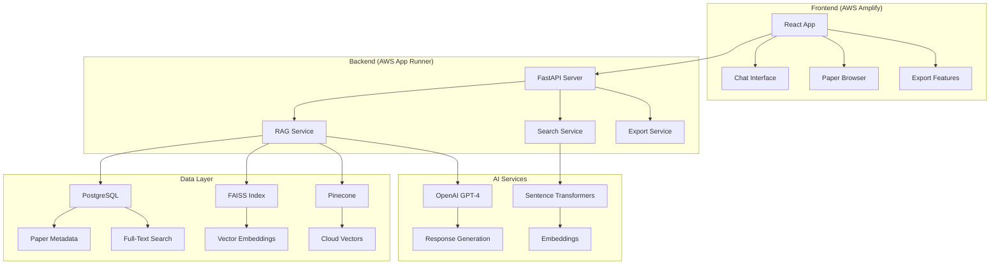

# 🔬 ArXiv Research Assistant

A sophisticated **Retrieval-Augmented Generation (RAG)** system that enables intelligent search and conversation with 497+ ArXiv astronomy research papers. Built with modern web technologies and deployed on AWS.


## 🌟 Features

### 🧠 **Intelligent RAG System**
- **Semantic Search**: Find papers using natural language queries
- **Conversational AI**: Chat with your research papers using OpenAI GPT-4
- **Hybrid Search**: Combines vector similarity (FAISS/Pinecone) with PostgreSQL full-text search
- **Context-Aware**: Maintains conversation history for better responses

### 📚 **Comprehensive Paper Database**
- **497+ Astronomy Papers**: Processed from ArXiv astro-ph category
- **Full-Text Extraction**: Complete PDF text extraction and processing
- **Smart Chunking**: Papers split into 200-600 token chunks for optimal search
- **Metadata Rich**: Titles, authors, abstracts, and full content indexed

### 🎨 **Modern Web Interface**
- **React Frontend**: Beautiful, responsive UI with Tailwind CSS
- **Real-time Chat**: Interactive conversation interface
- **Paper Browser**: Browse and explore research papers
- **LaTeX Rendering**: Mathematical equations rendered with MathJax
- **Export Features**: Download conversations as PDF or Markdown

### ☁️ **Production-Ready Architecture**
- **AWS Deployment**: Backend on App Runner, Frontend on Amplify
- **Scalable Database**: PostgreSQL with optimized indexes
- **Vector Storage**: FAISS for local, Pinecone for cloud vector search
- **Dockerized**: Containerized for easy deployment
- **Health Monitoring**: Comprehensive health checks and logging

## 🏗️ Architecture



## 📁 Project Structure

```
Codemate/
├── 📁 backend/                    # FastAPI Backend
│   ├── 🐍 app.py                 # Main FastAPI application
│   ├── 📁 src/                   # Source code
│   │   ├── 📁 api/               # API endpoints
│   │   │   ├── chat.py          # Chat/conversation endpoints
│   │   │   ├── search.py        # Search endpoints
│   │   │   └── health.py        # Health check endpoints
│   │   ├── 📁 services/          # Business logic services
│   │   │   ├── rag_service.py   # RAG conversation service
│   │   │   ├── search_service.py # Search orchestration
│   │   │   ├── postgres_service.py # Database operations
│   │   │   ├── faiss_service.py # Vector search
│   │   │   ├── pinecone_service.py # Cloud vector search
│   │   │   ├── export_service.py # PDF/Markdown export
│   │   │   └── conversation_service.py # Chat history
│   │   ├── 📁 models/            # Data models
│   │   └── 📁 core/              # Configuration
│   ├── 📁 data/                  # Research papers data
│   │   ├── 📁 pdfs/             # 497 PDF files
│   │   └── 📁 processed/        # Processed data
│   ├── 📁 scripts/              # Utility scripts
│   ├── 📄 requirements.txt      # Python dependencies
│   ├── 🐳 Dockerfile           # Container configuration
│   └── 📄 apprunner.yaml       # AWS App Runner config
├── 📁 frontend/                  # React Frontend
│   ├── 📁 src/                  # Source code
│   │   ├── 📁 components/       # React components
│   │   │   ├── Chatbot.jsx     # Main chat interface
│   │   │   ├── MessageList.jsx # Message display
│   │   │   ├── PaperList.jsx   # Paper browser
│   │   │   └── PaperDetail.jsx # Paper details
│   │   ├── 📄 App.jsx          # Main app component
│   │   └── 📄 config.js        # Environment configuration
│   ├── 📄 package.json         # Node.js dependencies
│   ├── 📄 vite.config.js       # Vite build configuration
│   └── 📄 amplify.yml          # AWS Amplify config
├── 📄 .gitignore               # Git ignore rules
└── 📄 README.md               # This file
```

## 🚀 Quick Start

### Prerequisites

- **Python 3.11+**
- **Node.js 16+**
- **PostgreSQL 15+**
- **Docker** (for containerization)

### Local Development

#### 1. **Backend Setup**

```bash
# Navigate to backend
cd backend

# Create virtual environment
python -m venv venv

# Activate virtual environment
# Windows:
venv\Scripts\activate
# macOS/Linux:
source venv/bin/activate

# Install dependencies
pip install -r requirements.txt

# Set up environment variables
cp env.example .env
# Edit .env with your database and API keys

# Start the server
python app.py
```

#### 2. **Frontend Setup**

```bash
# Navigate to frontend
cd frontend

# Install dependencies
npm install

# Start development server
npm run dev
```

#### 3. **Access the Application**

- **Frontend**: http://localhost:5173
- **Backend API**: http://localhost:8000
- **API Documentation**: http://localhost:8000/docs

## 🔧 Configuration

### Environment Variables

Create a `.env` file in the `backend/` directory:

```bash
# Database Configuration
DB_HOST=localhost
DB_PORT=5432
DB_NAME=Codemate
DB_USER=postgres
DB_PASSWORD=your-password

# OpenAI Configuration
OPENAI_API_KEY=your-openai-api-key
OPENAI_MODEL=gpt-4o

# Pinecone Configuration (Optional)
PINECONE_API_KEY=your-pinecone-api-key
PINECONE_INDEX_NAME=arxiv-papers

# Azure OpenAI (Alternative)
USE_AZURE_OPENAI=false
AZURE_OPENAI_API_KEY=your-azure-key
AZURE_OPENAI_ENDPOINT=https://your-resource.openai.azure.com/
```

## 📡 API Endpoints

### **Search Endpoints**
- `GET /api/v1/search` - Search papers with query parameters
- `POST /api/v1/search` - Search papers with request body

### **Chat Endpoints**
- `POST /api/v1/chat` - Start or continue a conversation
- `GET /api/v1/chat/health` - Check RAG service health
- `POST /api/v1/chat/export/{format}` - Export conversation (PDF/Markdown)

### **Health & Stats**
- `GET /api/v1/health` - Overall system health
- `GET /api/v1/stats` - Database statistics

### **Example API Usage**

```bash
# Search for papers about black holes
curl -X POST "http://localhost:8000/api/v1/search" \
  -H "Content-Type: application/json" \
  -d '{"query": "black holes", "n_results": 5, "search_type": "faiss"}'

# Start a conversation
curl -X POST "http://localhost:8000/api/v1/chat" \
  -H "Content-Type: application/json" \
  -d '{"query": "Tell me about exoplanet detection methods", "conversation_id": null}'
```

## ☁️ AWS Deployment

### **Backend to AWS App Runner**

1. **Build and push Docker image to ECR:**
```bash
# Make deployment script executable
chmod +x deploy-to-aws.sh

# Run deployment (requires AWS CLI configured)
./deploy-to-aws.sh
```

2. **Create App Runner service:**
   - Use the ECR image URL from the script output
   - Configure environment variables
   - Set health check path: `/api/v1/health`

### **Frontend to AWS Amplify**

1. **Connect GitHub repository to Amplify**
2. **Configure build settings:**
   - Root directory: `frontend/`
   - Build specification: `amplify.yml`
3. **Add environment variable:**
   - `REACT_APP_API_URL`: Your App Runner URL

### **Database Setup**

Create an RDS PostgreSQL instance:
```bash
aws rds create-db-instance \
  --db-instance-identifier arxiv-research-db \
  --db-instance-class db.t3.micro \
  --engine postgres \
  --engine-version 15.4 \
  --master-username postgres \
  --master-user-password your-secure-password \
  --allocated-storage 20 \
  --publicly-accessible true
```

## 🎯 Usage Examples

### **Research Queries**
- "What are the latest discoveries about black holes?"
- "Explain gravitational wave detection methods"
- "Find papers about exoplanet atmospheres"
- "What is dark matter and how do we study it?"

### **Conversation Features**
- **Follow-up Questions**: Ask clarifying questions about papers
- **Paper Exploration**: Click on referenced papers to explore them
- **Export Conversations**: Download your research sessions as PDF or Markdown
- **Context Awareness**: The AI remembers your conversation history

## 🔍 Search Types

### **1. Vector Search (FAISS/Pinecone)**
- Semantic similarity search
- Finds papers with similar concepts
- Best for: "papers like this one"

### **2. Full-Text Search (PostgreSQL)**
- Keyword-based search
- Searches titles, abstracts, and full text
- Best for: specific terms and phrases

### **3. Hybrid Search**
- Combines both approaches
- Provides most comprehensive results
- Best for: complex research queries

## 🛠️ Development

### **Adding New Papers**

```bash
# Process new PDFs
cd backend
python scripts/process_pdfs.py --input-dir /path/to/new/pdfs

# Generate embeddings
python scripts/generate_embeddings.py

# Update search index
python scripts/create_faiss_index.py
```

### **Customizing Search**

Modify search parameters in `backend/src/core/config.py`:
- Chunk size and overlap
- Embedding model
- Search result limits
- Similarity thresholds

## 📊 Performance

- **Search Speed**: Sub-second response times
- **Paper Processing**: ~3-4 seconds per PDF
- **Memory Usage**: ~2GB for full dataset
- **Storage**: ~500MB for processed data

## 🔒 Security

- **Environment Variables**: Sensitive data stored in environment variables
- **CORS Configuration**: Properly configured for production
- **Input Validation**: All inputs validated and sanitized
- **Rate Limiting**: Built-in protection against abuse

## 🤝 Contributing

1. Fork the repository
2. Create a feature branch
3. Make your changes
4. Add tests if applicable
5. Submit a pull request


## 🙏 Acknowledgments

- **ArXiv**: For providing the research papers
- **OpenAI**: For the GPT-4 language model
- **Hugging Face**: For the sentence-transformers library
- **FastAPI**: For the excellent web framework
- **React**: For the frontend framework

## 📞 Support

- **Issues**: Report bugs and feature requests on GitHub
- **Documentation**: Check the `/docs` endpoint for API documentation
- **Health Check**: Monitor system status at `/api/v1/health`

---